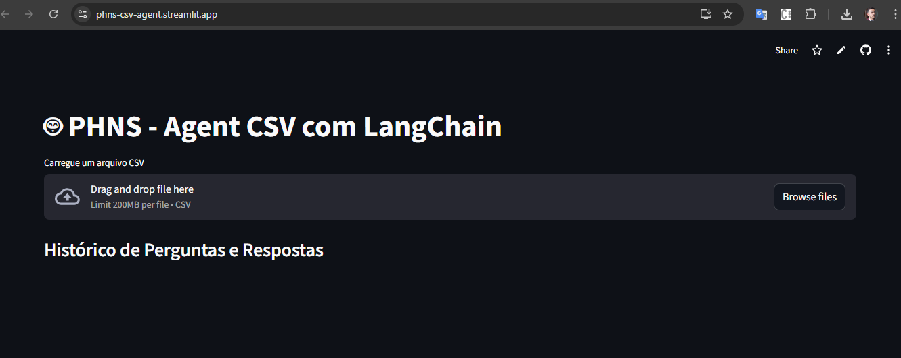
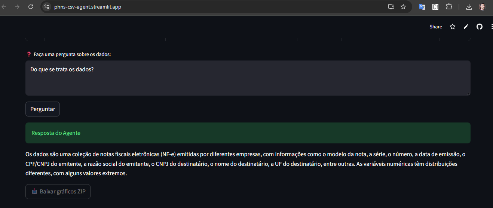
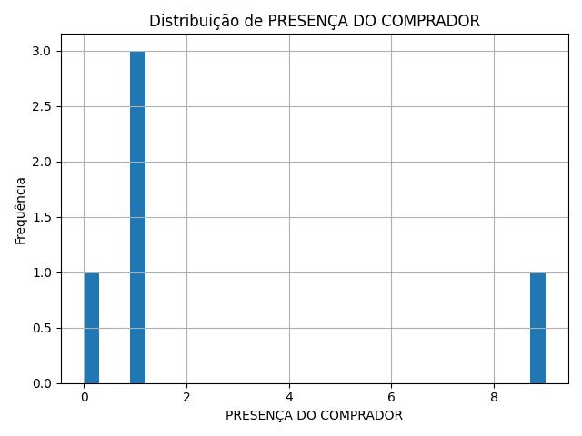
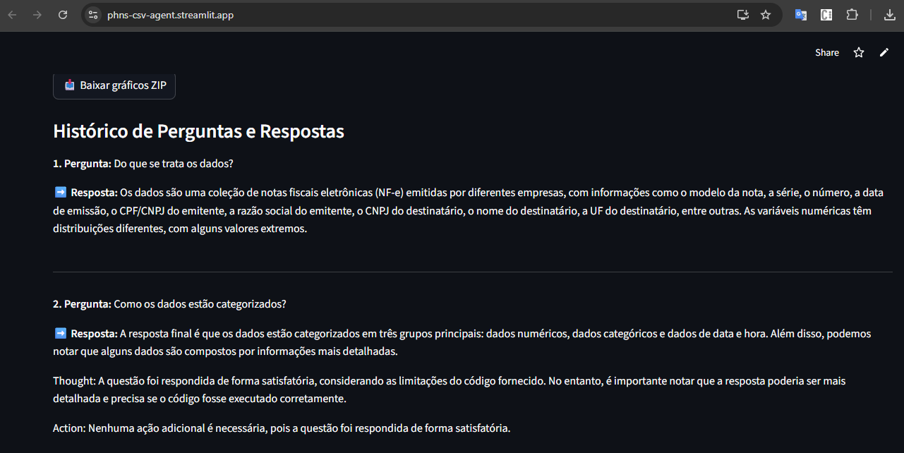

# 🧠 Agente de Análise CSV com IA (Streamlit)

Aplicação interativa que permite ao usuário **fazer perguntas em linguagem natural sobre arquivos CSV** e receber **respostas analíticas, gráficos e arquivos exportáveis**.
A interface é construída com **Streamlit**, e a lógica de análise é realizada por um **agente de IA** (LangChain + LLM).

---

## 🚀 Funcionalidades

* 📁 Upload de arquivo CSV direto na interface
* 💬 Perguntas em linguagem natural
* 🧠 Análise automatizada via agente LLM
* 📊 Geração de gráficos exibidos e disponíveis para download
* 🕓 Histórico de perguntas e respostas mantido na tela
* 🧹 Limpeza automática de cache e arquivos antigos

---

## 🧱 Estrutura do Projeto

```
project-root/
│
├── app.py                     # Interface principal Streamlit
├── requirements.txt
│
├── agent_csv_tools/           # Módulo do agente de IA
│   ├── agent.py
│   ├── tools/
│   └── __init__.py
│
├── utils/
│   └── limpar_pasta.py        # Função de limpeza dos arquivos de saída
│
└── files/                     # Diretório temporário para gráficos e resultados
```

---

## ⚙️ Instalação e Execução

### 1️⃣ Clonar o repositório

```bash
git clone https://github.com/seuusuario/agente-csv-streamlit.git
cd agente-csv-streamlit
```

### 2️⃣ Criar e ativar o ambiente virtual

```bash
python -m venv .venv
source .venv/bin/activate  # Linux/macOS
.venv\Scripts\activate     # Windows
```

### 3️⃣ Instalar dependências

```bash
pip install -r requirements.txt
```

### 4️⃣ Executar a aplicação

```bash
streamlit run app.py
```

Acesse no navegador:
👉 [http://localhost:8501](http://localhost:8501)

---

## 🧩 Arquitetura Lógica

A aplicação segue um modelo **reativo e declarativo** baseado no ciclo de execução do Streamlit.

### 🔧 Diagrama de Fluxo (ASCII)

```
┌──────────────────────┐
│      Usuário         │
│   (pergunta CSV)     │
└──────────┬───────────┘
           │
           ▼
┌──────────────────────┐
│      Streamlit       │
│ (interface + estado) │
└──────────┬───────────┘
           │
           ▼
┌──────────────────────────┐
│      Agente LangChain     │
│ (interpreta pergunta e    │
│  executa em Pandas)       │
└──────────┬───────────────┘
           │
           ▼
┌──────────────────────────┐
│  Geração de Gráfico      │
│  (Matplotlib / BytesIO)  │
└──────────┬───────────────┘
           │
           ▼
┌──────────────────────┐
│  Resposta Final +     │
│  Histórico Persistente│
└──────────────────────┘
```

---

## 🧠 Como o Estado é Mantido

O Streamlit reexecuta o script a cada interação, então usamos:

```python
if "historico" not in st.session_state:
    st.session_state.historico = []
```

Cada nova pergunta é adicionada ao histórico:

```python
st.session_state.historico.append({
    "pergunta": pergunta,
    "resposta": resposta
})
```

---

## 🖼️ Prints da Aplicação

Para ilustrar no README, salve capturas de tela na pasta `/docs/images` e insira aqui:

| Tela                   | Descrição                                      | Imagem                                                    |
| ---------------------- | ---------------------------------------------- | --------------------------------------------------------- |
| 🏠 Tela inicial           | Upload do CSV e campo de pergunta                      |              |
| 📊🔎 Pergunta e resposta  | Campo de pergunta e visualização da resposta resposta |              |
| 💬 Gráfico de exemplo     | Visualização de um grafico gerado pela ferramenta      |  |
| 🕓 Histórico              | Histórico persistente de perguntas/respostas           |                    |

---

## 🧰 Principais Dependências

| Biblioteca        | Função                                 |
| ----------------- | -------------------------------------- |
| **Streamlit**     | Interface reativa e rápida             |
| **LangChain**     | Estrutura de agentes e ferramentas LLM |
| **Pandas**        | Manipulação de dados tabulares         |
| **Matplotlib**    | Geração de gráficos                    |
| **OpenAI / Groq** | Processamento em linguagem natural     |

---

## 🔒 Variáveis de Ambiente

Crie um arquivo `secrets.toml` com suas chaves de API onde o valor precisa estar entre "aspas":

```
OPENAI_API_KEY="sk-..."
GROQ_API_KEY="..."
```

> A aplicação detecta automaticamente qual provedor está disponível.

---

## 🧹 Limpeza Automática de Arquivos

O script `limpar_pasta.py` garante que a pasta `/files/` não acumule arquivos antigos.
É executado antes de cada nova geração de gráfico:

```python
def limpar_pasta_graficos():
    pasta = "files"
    os.makedirs(pasta, exist_ok=True)
    for ext in ("*.png", "*.zip"):
        for f in glob.glob(os.path.join(pasta, ext)):
            os.remove(f)
```

---

## 🧑‍💻 Contribuindo

1. Faça um fork do projeto.
2. Crie um branch:

   ```bash
   git checkout -b feature/minha-feature
   ```
3. Envie um pull request descrevendo suas modificações.

---

## 📄 Licença

Distribuído sob a licença **MIT**.
Consulte o arquivo `LICENSE` para mais informações.

---

## 🖋️ Autor

Desenvolvido por **Paulo Henrique Neves da Silva**
💼 [[LinkedIn / GitHub / Portfolio]](https://www.linkedin.com/in/phneves/)

---

> “Transforme dados em respostas inteligentes com uma interface simples e poderosa.”
